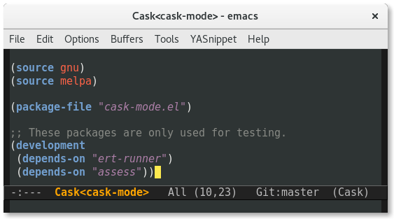

# cask-mode

cask-mode is a major mode for editing Cask files. It provides syntax
highlighting, comment toggling and indentation.

## Installation

Install from MELPA
([awaiting approval](https://github.com/melpa/melpa/pull/3737)) or add
to your load-path manually.

## Usage

Just open a Cask file! Alternatively, `M-x cask-mode` will start the
mode explicitly.

